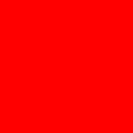

# Spanish Color Vocabulary Project 🎨

Proyek sederhana untuk belajar nama-nama warna dalam Bahasa Spanyol menggunakan HTML dan CSS. Setiap warna ditampilkan sebagai judul (dalam Bahasa Spanyol) beserta gambar contoh warnanya, lalu judul tersebut diwarnai sesuai maknanya menggunakan CSS.

## Struktur File

```
5.4+Color+Vocab+Project/
├── index.html      # Struktur halaman (judul warna + gambar)
├── style.css       # Styling: mewarnai teks, ukuran gambar, dll.
└── assets/
    └── images/     # Gambar untuk tiap warna (red.png, blue.png, dst.)
```

## Penjelasan `index.html`

File ini berisi struktur/isi halaman web. Bagian pentingnya:

```html
<link rel="stylesheet" href="./style.css" />
```
Baris ini menghubungkan `index.html` dengan file `style.css`, supaya semua styling (warna, ukuran, dll.) diatur dari file CSS secara terpisah — bukan ditulis langsung di HTML.

```html
<h2 class="color-title" id="red">Rojo</h2>

```
Pola ini diulang untuk 5 warna: **Rojo** (Merah), **Azul** (Biru), **Anaranjado** (Oranye), **Verde** (Hijau), **Amarillo** (Kuning).

Setiap warna punya dua atribut penting pada elemen `<h2>`:
- **`class="color-title"`** — dipakai untuk menerapkan style yang sama ke *semua* judul warna sekaligus (misalnya `font-weight: normal`).
- **`id="red"`** (atau `blue`, `green`, dst.) — id yang unik untuk *setiap* judul, dipakai untuk memberi warna teks yang berbeda-beda sesuai nama warnanya.

Di bawah tiap judul ada `` yang menampilkan gambar contoh warna tersebut, diambil dari folder `assets/images/`.

> **Catatan:** Sesuai instruksi asli di file (lihat komentar di bagian bawah `index.html`), file HTML ini **tidak boleh diubah**. Semua styling harus dilakukan lewat CSS.

## Penjelasan `style.css`

```css
.color-title {
    font-weight: normal;
}
```
Karena `<h2>` secara default punya teks tebal (bold), aturan ini menargetkan **semua elemen dengan class `color-title`** dan membuat ketebalan teksnya normal (tidak bold).

```css
#red {
    color: red;
}
#blue {
    color: blue;
}
#green {
    color: green;
}
#orange {
    color: orange;
}
#yellow {
    color: yellow;
}
```
Setiap aturan ini menargetkan elemen berdasarkan `id`-nya masing-masing (menggunakan tanda `#`). Jadi judul dengan `id="red"` (yaitu "Rojo") diberi warna teks merah, `id="blue"` ("Azul") diberi warna biru, dan seterusnya. Inilah cara CSS "menerjemahkan" kata Spanyol menjadi warna yang sesuai secara visual.

```css
img {
    width: 200px;
    height: 200px;
}
```
Aturan ini menargetkan **semua elemen ``** di halaman, membuat setiap gambar berukuran tetap 200px lebar dan 200px tinggi, supaya semua gambar warna punya ukuran yang seragam.

## Konsep CSS yang Dipelajari

| Selector | Fungsi |
|---|---|
| `.class-name` | Menargetkan **semua** elemen yang punya class tersebut (styling bersama) |
| `#id-name` | Menargetkan **satu** elemen spesifik dengan id tersebut (styling unik) |
| `tag-name` (mis. `img`) | Menargetkan **semua** elemen dengan tag tersebut |

Kombinasi class dan id ini adalah teknik umum di CSS: **class untuk style yang dipakai bersama**, **id untuk style yang unik per elemen**.

## Cara Menjalankan

Cukup buka file `index.html` langsung di browser (double-click atau klik kanan → Open with Browser). Tidak perlu server atau instalasi apa pun karena proyek ini murni HTML + CSS.

## Folder `solution/`

Folder ini berisi contoh jawaban (`solution.html` dan `style.css`) sebagai referensi pembanding, jika ingin mengecek hasil pekerjaan sendiri.
